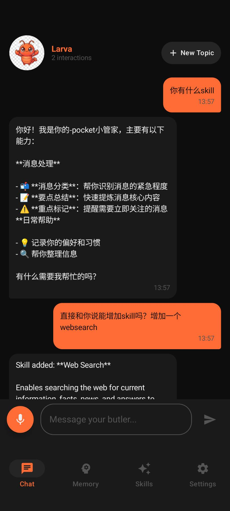
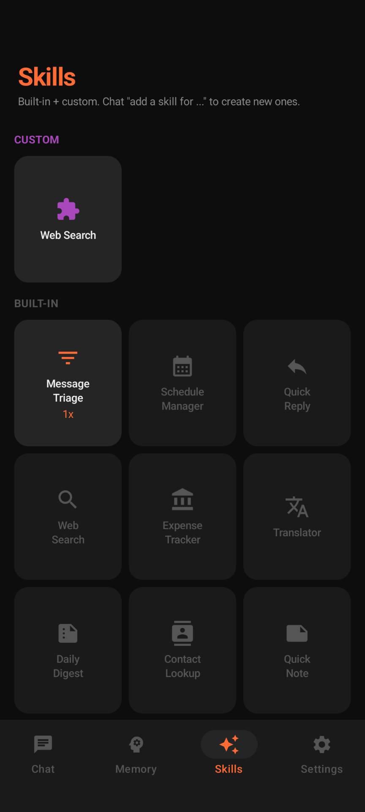
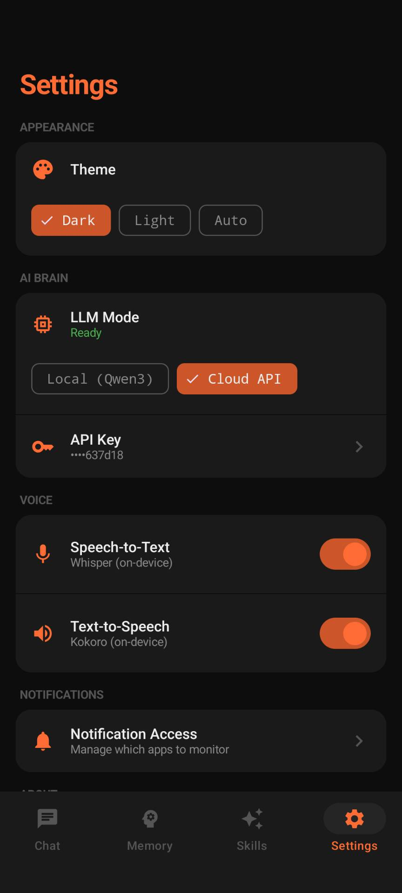

<div align="center">

# 🦞 PocketClaw

### Your AI butler. In your pocket. No server required.

**A serverless, mobile-native AI agent.**
One APK. Runs on your phone. Not in a datacenter.

[](https://github.com/HenryZ838978/pocketclaw/releases/latest)
[](#-project-structure)
[](LICENSE)

<br>

> *A butler locked in your datacenter is not a butler.*
> *A butler walks where you walk.*

<br>

</div>

---

## 📱 Android APP Released!

PocketClaw v0.4.1 is live on real hardware. **[Download the APK →](https://github.com/HenryZ838978/pocketclaw/releases/latest)**

One install — no server, no Docker, no terminal, no API key required.

<div align="center">
<table>
<tr>
<td align="center"><b>💬 Chat + Add Skills</b></td>
<td align="center"><b>✨ Skills Dashboard</b></td>
<td align="center"><b>⚙️ Settings</b></td>
</tr>
<tr>
<td></td>
<td></td>
<td></td>
</tr>
<tr>
<td><i>"Add a websearch skill" → Done.</i></td>
<td><i>Built-in + unlimited custom skills</i></td>
<td><i>Local LLM ↔ Cloud API one-tap switch</i></td>
</tr>
</table>
</div>

---

## 🤔 Why

Most AI agents today live on your laptop — Docker, Node.js, terminal. That's great if you're a developer at your desk.

But most of the time, **you're not at your desk. You're on your phone.**

PocketClaw is a different take: what if the agent lived *in your pocket* from day one?

```
 Desktop Agents                    PocketClaw
 ─────────────                     ──────────
 💻 Docker / Node.js               📱 One APK install
 🔌 Dies when you leave home       🚶 Walks with you
 🌐 Needs a server                 📴 Runs locally, no server
 💰 $15-40/month API costs         🆓 Free with on-device LLM
 👨‍💻 Developers only                👤 Anyone
```

---

## ⚡ Quick Start

**Option A — Download APK (easiest)**

Go to [Releases](https://github.com/HenryZ838978/pocketclaw/releases/latest), download `PocketClaw-v0.4.1-debug.apk`, install on your Android phone.

**Option B — Build from source**

```bash
cd PocketClaw/android
./gradlew assembleDebug
adb install -r app/build/outputs/apk/debug/app-debug.apk
```

> Uses on-device Qwen3 by default (free, offline). Toggle to Cloud API in Settings if you want.

---

## 🔧 What It Can Do

PocketClaw can **act**, not just chat. 16 built-in tools with 4-level security:

| Category | Tools | Security |
|----------|-------|----------|
| **Files** | read · write · list · delete | L0-L2 |
| **Clipboard** | read · write | L0-L1 |
| **Web** | search (DuckDuckGo) | L0 |
| **Schedule** | create · list reminders | L0-L1 |
| **Apps** | launch any installed app | L1 |
| **Messaging** | send via Telegram | L2 |
| **Screen** | read · tap · swipe · input · back | L0-L3 (experimental) |

> **L0** = auto-approve · **L1** = first-time grant · **L2** = confirm every time · **L3** = confirm + auto-revoke

### Example

```
You:        "搜一下明天北京的天气"
PocketClaw: "我来帮你查！"
             → [T:web_search:北京 明天 天气]
             → "明天北京晴，最高 22°C，最低 8°C"
```

---

## 🛡️ Security

AI agents that can act on your behalf need to be trustworthy. PocketClaw uses 4 layers:

| Layer | What it does |
|-------|-------------|
| **PermissionGuard** | Every tool has a risk level (L0-L3). High-risk tools require explicit user confirmation via dialog. |
| **PathSandbox** | File tools can only access `/PocketClaw`, `/Download`, `/Documents`. System paths blocked. |
| **RateLimiter** | Max tool calls per turn. Cooldown between calls. Consecutive-fail circuit breaker. |
| **AuditLog** | Every tool invocation is logged and viewable in Settings. |

---

## 🧠 Dual-Mode Brain

| | Local Mode | Cloud Mode |
|---|---|---|
| **Model** | Qwen3-1.7B (Q8_0) | MiniMax-M2.5 |
| **Runs on** | Your phone (llama.cpp) | DashScope API |
| **Privacy** | 100% offline | Data sent to cloud |
| **Cost** | Free | ~¥40/month |
| **Switch** | One tap in Settings | One tap in Settings |

---

## 🦞 Bond System — It Remembers You

PocketClaw isn't stateless. It builds a memory of who you are:

- **Preferences** — "I like braised pork" → remembered
- **Habits** — "I always check news in the morning" → learned
- **Relationships** — "My mom's name is Li Wei" → stored
- **Facts** — "My office is in Zhongguancun" → noted

Your claw grows through 5 stages as you interact: Larva → Hatchling → Juvenile → Adult → Elder.

---

## 🏗️ Architecture

```
┌─────────────────────────────────────────────────┐
│                  SINGLE APK                      │
│                                                  │
│  Input → SOUL Prompt → LLM → ToolParser         │
│          (Assembler)   (Local    (Parse [T:]     │
│                        or Cloud)  markers)       │
│                                      ↓           │
│                              PermissionGuard     │
│                                      ↓           │
│                              ToolExecutor        │
│                              (Execute + Audit)   │
│                                      ↓           │
│                              Second-pass LLM     │
│                              (Final reply)       │
│                                                  │
└─────────────────────────────────────────────────┘
```

---

## 🗂️ Project Structure

```
PocketClaw/android/app/src/main/java/
├── com/pocketclaw/
│   ├── app/                    # App layer (23 files)
│   │   ├── ui/                 # Chat · Memory · Skills · Settings
│   │   ├── messaging/          # Telegram · Discord · Feishu · Slack
│   │   ├── service/            # ScreenControl · TaskWorker
│   │   └── api/                # DashScopeProvider
│   └── claw/                   # Intelligence layer (27 files)
│       ├── tools/              # 16 tools + Parser · Executor · Registry
│       ├── security/           # PermissionGuard · AuditLog · PathSandbox
│       ├── prompt/             # SOUL · PromptAssembler · ContextBudget
│       ├── bond/               # BondEngine · Memory · Growth
│       └── skills/             # SkillRouter · CustomSkill
└── com/llmhub/llmhub/         # Engine layer (42 files, fork)
    └── inference · chat · model · TTS
```

---

## 🌊 Inspired By

PocketClaw stands on the shoulders of the open-source AI agent community:

- [OpenClaw](https://github.com) (294K★) — pioneered the personal AI agent category
- [NanoClaw](https://github.com) (20K★) — showed that security-first design matters
- [ZeroClaw](https://github.com) (25K★) — proved Rust can build lightweight agents
- [LLM Hub](https://github.com) — provided the on-device inference engine we built upon

**Our different bet:** agents should be mobile-native and serverless from day one, not desktop-first with mobile as an afterthought.

---

## 🗺️ Roadmap

- [x] On-device LLM (Qwen3 via llama.cpp)
- [x] Cloud API mode (DashScope)
- [x] 16 built-in tools with 4-layer security
- [x] Bond growth system (5 stages)
- [x] Custom skills via chat
- [x] STT + TTS
- [x] 4-platform messaging bridge
- [ ] Auto-download models (no ADB needed)
- [ ] Home screen Widget
- [ ] Vision (screenshot + multimodal)
- [ ] APK size optimization (420MB → <200MB)
- [ ] iOS companion

---

## 🤝 Contributing

PocketClaw is in active development. We'd love help with:

- **Android** — better mobile agent UX
- **Prompts** — tuning SOUL prompts for different LLMs
- **Security** — auditing the permission/sandbox model
- **i18n** — the app supports 18 languages

---

## 📜 License

MIT License. See [LICENSE](LICENSE).

---

<div align="center">

**🦞 Let your AI walk with you.**

*PocketClaw — Project Carcinization*

</div>
